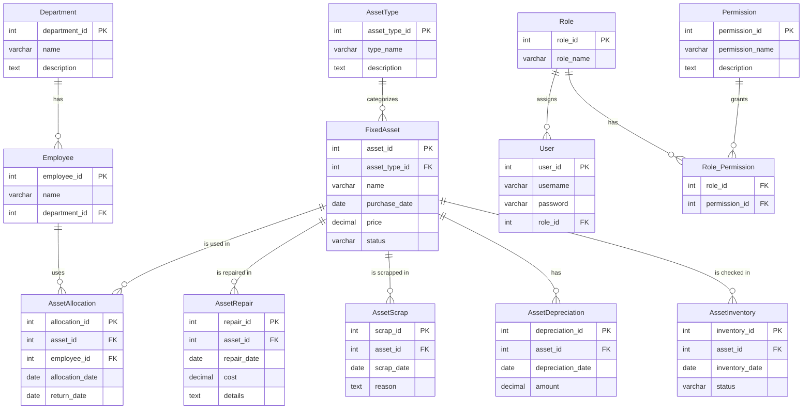

## ER图

```mermaid
erDiagram
   Department ||--o{ Employee : "has"
   Employee ||--o{ AssetAllocation : "uses"
   FixedAsset ||--o{ AssetAllocation : "is used in"
   FixedAsset ||--o{ AssetRepair : "is repaired in"
   FixedAsset ||--o{ AssetScrap : "is scrapped in"
   FixedAsset ||--o{ AssetDepreciation : "has"
   FixedAsset ||--o{ AssetInventory : "is checked in"
   AssetType ||--o{ FixedAsset : "categorizes"
   Role ||--o{ User : "assigns"
   Permission ||--o{ Role_Permission : "grants"
   Role ||--o{ Role_Permission : "has"

   Department {
      int department_id PK
      varchar name
      text description
   }

   Employee {
      int employee_id PK
      varchar name
      int department_id FK
   }

   FixedAsset {
      int asset_id PK
      int asset_type_id FK
      varchar name
      date purchase_date
      decimal price
      varchar status
   }

   AssetType {
      int asset_type_id PK
      varchar type_name
      text description
   }

   AssetAllocation {
      int allocation_id PK
      int asset_id FK
      int employee_id FK
      date allocation_date
      date return_date
   }

   AssetRepair {
      int repair_id PK
      int asset_id FK
      date repair_date
      decimal cost
      text details
   }

   AssetScrap {
      int scrap_id PK
      int asset_id FK
      date scrap_date
      text reason
   }

   AssetDepreciation {
      int depreciation_id PK
      int asset_id FK
      date depreciation_date
      decimal amount
   }

   AssetInventory {
      int inventory_id PK
      int asset_id FK
      date inventory_date
      varchar status
   }

   User {
      int user_id PK
      varchar username
      varchar password
      int role_id FK
   }

   Role {
      int role_id PK
      varchar role_name
   }

   Permission {
      int permission_id PK
      varchar permission_name
      text description
   }

   Role_Permission {
      int role_id FK
      int permission_id FK
   }

```