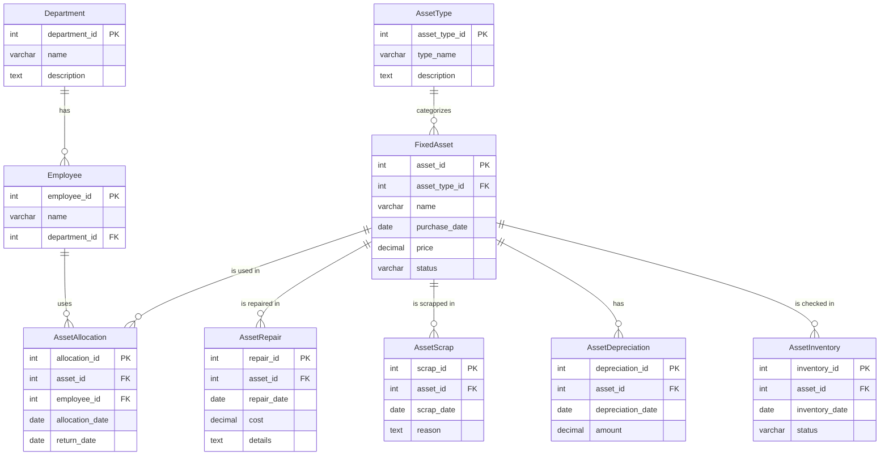

# 提示文件
> 此文件负责提示一些项目配置中的问题，以及更新日志等，
> 因为有的时候，有些配置文件两台电脑上是不同的，所以需要注意一下。
> 否则可能运行会出现问题

## 项目配置
[项目配置文件](./src/main/resources/application.properties)

## 测试文件
> `src/test/java/com/example/fixed_assets`该目录下全部是测试文件,
> 测试文件相比网页调试更加方便，可以直接调用方法进行测试，而不用每次都启动服务器
> 因此可以更加方便的进行后端测试
> 想要测试只需要直接运行测试文件即可
 
目前测试文件主要分为Controller层、Service层的测试
不过由于Controller层的测试需要模拟http请求，所以就使用专门的http请求
测试工具进行测试，而Service层的测试则是直接调用方法进行测试
因此该项目中的Controller层测试文件<font color=red>应该是被废弃的</font>

## 目录结构
```shell
your-project-name/
│
├── src/
│   ├── main/
│   │   ├── java/
│   │   │   └── com/
│   │   │       └── example/
│   │   │           ├── YourProjectApplication.java
│   │   │           │
│   │   │           ├── controller/        // 控制层
│   │   │           │   ├── DepartmentController.java
│   │   │           │   ├── EmployeeController.java
│   │   │           │   ├── FixedAssetController.java
│   │   │           │   ├── AssetTypeController.java
│   │   │           │   ├── AssetAllocationController.java
│   │   │           │   ├── AssetReturnController.java
│   │   │           │   ├── AssetRepairController.java
│   │   │           │   ├── AssetScrapController.java
│   │   │           │   ├── AssetDepreciationController.java
│   │   │           │   ├── AssetInventoryController.java
│   │   │           │   ├── UserController.java
│   │   │           │   └── StatisticsController.java
│   │   │           │
│   │   │           ├── service/           // 服务层
│   │   │           │   ├── DepartmentService.java
│   │   │           │   ├── EmployeeService.java
│   │   │           │   ├── FixedAssetService.java
│   │   │           │   ├── AssetTypeService.java
│   │   │           │   ├── AssetAllocationService.java
│   │   │           │   ├── AssetReturnService.java
│   │   │           │   ├── AssetRepairService.java
│   │   │           │   ├── AssetScrapService.java
│   │   │           │   ├── AssetDepreciationService.java
│   │   │           │   ├── AssetInventoryService.java
│   │   │           │   ├── UserService.java
│   │   │           │   └── StatisticsService.java
│   │   │           │
│   │   │           ├── service/impl/      // 服务层实现
│   │   │           │   ├── DepartmentServiceImpl.java
│   │   │           │   ├── EmployeeServiceImpl.java
│   │   │           │   ├── FixedAssetServiceImpl.java
│   │   │           │   ├── AssetTypeServiceImpl.java
│   │   │           │   ├── AssetAllocationServiceImpl.java
│   │   │           │   ├── AssetReturnServiceImpl.java
│   │   │           │   ├── AssetRepairServiceImpl.java
│   │   │           │   ├── AssetScrapServiceImpl.java
│   │   │           │   ├── AssetDepreciationServiceImpl.java
│   │   │           │   ├── AssetInventoryServiceImpl.java
│   │   │           │   ├── UserServiceImpl.java
│   │   │           │   └── StatisticsServiceImpl.java
│   │   │           │
│   │   │           ├── dao/               // 数据访问层
│   │   │           │   ├── DepartmentDao.java
│   │   │           │   ├── EmployeeDao.java
│   │   │           │   ├── FixedAssetDao.java
│   │   │           │   ├── AssetTypeDao.java
│   │   │           │   ├── AssetAllocationDao.java
│   │   │           │   ├── AssetReturnDao.java
│   │   │           │   ├── AssetRepairDao.java
│   │   │           │   ├── AssetScrapDao.java
│   │   │           │   ├── AssetDepreciationDao.java
│   │   │           │   ├── AssetInventoryDao.java
│   │   │           │   ├── UserDao.java
│   │   │           │   └── StatisticsDao.java
│   │   │           │
│   │   │           └── entity/            // 实体类
│   │   │               ├── Department.java
│   │   │               ├── Employee.java
│   │   │               ├── FixedAsset.java
│   │   │               ├── AssetType.java
│   │   │               ├── AssetAllocation.java
│   │   │               ├── AssetReturn.java
│   │   │               ├── AssetRepair.java
│   │   │               ├── AssetScrap.java
│   │   │               ├── AssetDepreciation.java
│   │   │               ├── AssetInventory.java
│   │   │               ├── User.java
│   │   │               └── Statistics.java
│   │   │           
│   │   │
│   │   └── resources/
│   │       ├── mapper/                    // MyBatis映射文件
│   │       ├── application.properties     // 应用配置文件
│   │       └── ...
│   │
│   └── test/
│       └── java/
│           └── com/
│               └── yourcompany/
│                   ├── controller/        // 控制器测试
│                   │   ├── DepartmentControllerTest.java
│                   │   ├── EmployeeControllerTest.java
│                   │   ├── FixedAssetControllerTest.java
│                   │   └── ... (其他控制器测试)
│                   │
│                   ├── service/           // 服务层测试
│                   │   ├── DepartmentServiceTest.java
│                   │   ├── EmployeeServiceTest.java
│                   │   ├── FixedAssetServiceTest.java
│                   │   └── ... (其他服务测试)
│                   │
│                   ├── dao/               // 数据访问层测试
│                   │   ├── DepartmentDaoTest.java
│                   │   ├── EmployeeDaoTest.java
│                   │   ├── FixedAssetDaoTest.java
│                   │   └── ... (其他DAO测试)
│                   │
│                   └── entity/            // 实体测试
│                       ├── DepartmentTest.java
│                       ├── EmployeeTest.java
│                       ├── FixedAssetTest.java
│                       └── ... (其他实体测试)
│
├── pom.xml                               // Maven配置文件
└── README.md
```

## 系统架构图


## ER图


## 开发计划
### 后端开发计划
1. **登录**
    - [x] 用户登录功能
    - [ ] 用户权限管理
2. **基本信息管理**
    - [ ] 部门信息管理
        - [ ] 实现部门信息的增加、删除、修改、查询功能
    - [ ] 员工信息管理
        - [ ] 实现员工信息的增加、删除、修改、查询功能

3. **固定资产管理**
    - [x] 固定资产信息管理（已完成）
    - [ ] 固定资产类型管理
        - [ ] 实现资产类型的增加、删除、修改、查询功能
    - [ ] 固定资产领用管理
        - [ ] 实现资产领用流程的处理逻辑
    - [ ] 固定资产维修管理
        - [ ] 实现资产维修流程的处理逻辑
    - [ ] 固定资产报废管理
        - [ ] 实现资产报废流程的处理逻辑
    - [ ] 固定资产折旧核算
        - [ ] 实现资产折旧的计算和记录功能
    - [ ] 固定资产盘点
        - [ ] 实现资产盘点流程的处理逻辑

4. **数据统计**
    - [ ] 分类统计
        - [ ] 实现按照资产类型进行数据统计
    - [ ] 部门统计
        - [ ] 实现按照部门进行资产数据统计

### 单元测试计划

单元测试是针对程序的最小可测试部分（通常是函数或方法）进行的测试。目的是验证这些部分是否按预期工作。
1. **登录**
    - [x] 测试用户登录功能是否能正确处理不同用户的输入和异常情况。
2. **基本信息管理**
    - 部门信息管理
        -[ ] 测试增加、删除、修改、查询功能是否正确处理各种数据输入和边界情况。
    - 员工信息管理
        -[ ] 测试增加、删除、修改、查询功能是否正确处理不同员工信息和异常情况。

3. **固定资产管理**
    - 固定资产类型管理
        - [ ] 测试资产类型的增加、删除、修改、查询功能，包括类型属性的正确性和异常输入的处理。
    - 固定资产领用管理
        - [ ] 测试领用流程是否正确处理资产状态、用户权限和时间限制。
    - 固定资产维修管理
        - [ ] 测试维修流程是否正确处理维修详情、成本计算和时间记录。
    - 其他子模块
        - [ ] 对报废管理、折旧核算和盘点等功能进行类似的测试。

4. **数据统计**
    - 测试分类统计和部门统计功能是否能正确计算和显示数据。

### 集成测试计划

集成测试是将各个单元组合在一起，并测试作为一个整体时它们的行为。目的是验证不同模块之间的接口和交互是否按预期工作。

1. **模块间接口测试**
    - [ ] 测试基本信息管理模块与固定资产管理模块之间的数据交互，例如员工信息对资产领用的影响。
    - [ ] 测试固定资产管理模块的不同子模块间如何交互，例如资产领用如何影响资产维修和报废流程。

2. **数据流测试**
    - [ ] 确保数据在整个系统中正确流动，例如从资产类型管理到资产信息管理的流程。

3. **功能集成测试**
    - [ ] 测试系统中的业务流程，例如从资产登记到领用、维修、折旧计算，直到报废的整个流程。

4. **用户场景测试**
    - [ ] 模拟真实用户操作，测试系统功能是否能满足用户需求。

每个测试应该包括正常情况下的预期行为以及异常情况下的错误处理。这些测试将帮助确保系统的健壯性和可靠性。同时，也要注意测试用例的覆盖率，确保测试到系统的每个重要部分。

请根据项目的具体情况调整这个计划。在实际操作中，可能需要根据开发进度和遇到的问题做出相应的调整。
