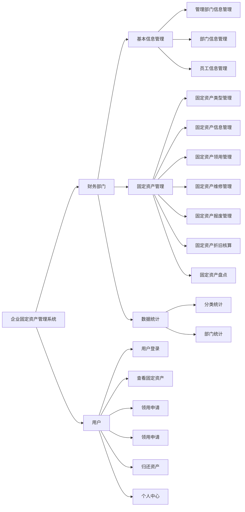
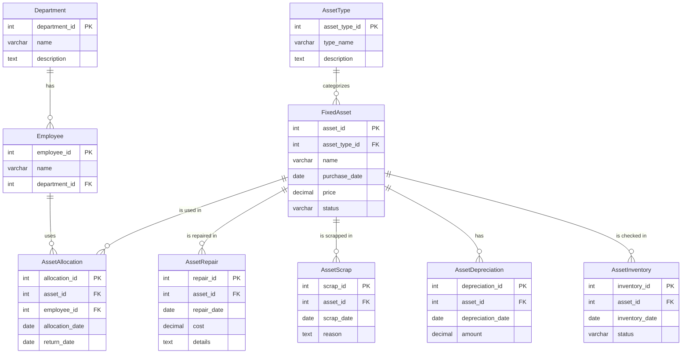

# 提示文件
> 此文件负责提示一些项目配置中的问题，以及更新日志等，
> 因为有的时候，有些配置文件两台电脑上是不同的，所以需要注意一下。
> 否则可能运行会出现问题

## 项目配置
[项目配置文件](./src/main/resources/application.properties)

## 测试文件
> `src/test/java/com/example/fixed_assets`该目录下全部是测试文件,
> 测试文件相比网页调试更加方便，可以直接调用方法进行测试，而不用每次都启动服务器
> 因此可以更加方便的进行后端测试
> 想要测试只需要直接运行测试文件即可

## 系统架构图

## ER图

