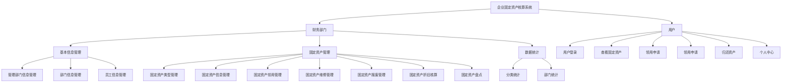

## 系统架构图

```mermaid
graph 
    A[企业固定资产核算系统] --> B[财务部门]
    A --> C[用户]
    B --> D[基本信息管理]
    B --> E[固定资产管理]
    B --> F[数据统计]
    C --> G[用户登录]
    C --> H[查看固定资产]
    C --> I[领用申请]
    C --> J[领用申请]
    C --> K[归还资产]
    C --> L[个人中心]
    D --> M[管理部门信息管理]
    D --> N[部门信息管理]
    D --> O[员工信息管理]
    E --> P[固定资产类型管理]
    E --> Q[固定资产信息管理]
    E --> R[固定资产领用管理]
    E --> S[固定资产维修管理]
    E --> T[固定资产报废管理]
    E --> U[固定资产折旧核算]
    E --> V[固定资产盘点]
    F --> W[分类统计]
    F --> X[部门统计]
```